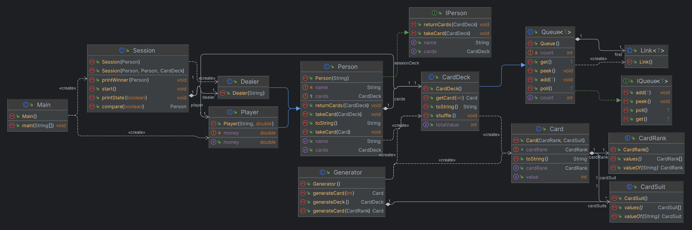

# Black Jack
## About project
This project is designed to practice inheritance, abstract data types, and other important programming concepts.
## About game
Blackjack is a popular card game played in casinos around the world, also known as 21. The objective of the game is to beat the dealer by having a hand value closer to 21 without going over. Each player is dealt two cards, and can then choose to "hit" and receive additional cards or "stand" and keep their current hand. A hand containing an Ace and a card worth 10 points is considered a "blackjack" and automatically wins. The game has a variety of strategies and variations, making it a favorite among both novice and experienced gamblers.
### How to play
1. Download .zip package from GitHub.
2. Unpack .zip and enter the folder.
3. Run file *start.sh*.
4. Enjoy!

### Program Design
When designing a program, it is important to carefully consider which abstract data type best suits the requirements of the project. In the case of a deck of cards, a queue was chosen as the appropriate data type because the cards are inserted and removed from the deck in a specific order. A queue as an abstract data type allows elements to be inserted at the end and removed from the beginning, which corresponds to the order of cards in the deck. By using a queue, it is ensured that the cards in the deck are properly ordered and easily accessible for further processing within the program.

The game is conducted within a class called "Session", which stores references to the players (the dealer and the user) and the deck of cards. All logic for evaluating cards, handling bets, and other game-related tasks is contained within this class. By consolidating these functions within the Session class, the program becomes more organized and easier to maintain. The class is responsible for managing the game state and ensuring that all necessary actions are performed in a logical order. It is also responsible for determining the winner of each hand and updating the players' chip counts accordingly. The Session class serves as the backbone of the game and is crucial for providing a smooth and enjoyable gaming experience.
#### Detailed UML diagram

## What to do next
* Create UI for the game.
* Create graphics for the game.
* Add more JUnit tests.
---
ChatGPT assisted while creating this README file.